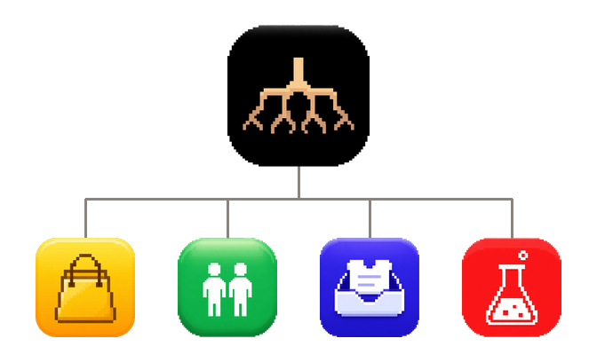

<p align="center">
  
</p>

# Root

Built for the [WebMCP Challenge](https://openai.com/webmcp-challenge/).

<p>
  
  &nbsp;&nbsp;
  
  &nbsp;&nbsp;
  
  &nbsp;&nbsp;
  
  &nbsp;&nbsp;
  
  &nbsp;&nbsp;
  
  &nbsp;&nbsp;
  
</p>

A workspace where a person and an agent share the same live apps. Each app is a real site in its own window. The agent uses WebMCP tools that site registers. The person can take the window back at any time.

## Providers

Root loads each provider in an iframe (`allow="tools"`) and talks only to tools that document exposes to Root. It does not scrape the page.

 <strong>Catalog</strong> — search, open, and create products.

 <strong>Customers</strong> — search, open, and create customers.

 <strong>Cases</strong> — search, open, and create support cases.

 <strong>Lab</strong> — add in Apps, Test, then grant tools. Not on prepare.

A person and an agent can run a pass across Catalog, Customers, and Cases on the live windows: search, open a record, fill a create form. Writes, search picks, and a field the person takes over wait for them on stage. A site that is not builtin can still join after a human grant (`invoke_granted_tool`). Take control stops the agent on that window.

## WebMCP

Root’s own document registers the gateway: `list_providers`, `discover_capabilities`, `prepare_workflow`, `execute_workflow`, `invoke_granted_tool`, inspect, cancel, and window chrome.

Each provider registers tools on its document and exposes them to Root only:

```js
document.modelContext.registerTool(
  {
    name: "search_products",
    description: "Search the product catalog",
    inputSchema: { /* ... */ },
    execute: async (input) => { /* ... */ },
  },
  { exposedTo: ["http://localhost:3000"] },
);
```

`prepare_workflow` freezes an allowlisted builtin graph. `execute_workflow` opens or reuses those windows, rediscovers, and invokes on the live documents. Custom tools never enter that pass.

## Run

Chrome 149 or later. Enable `chrome://flags/#enable-webmcp-testing` and restart. Nested provider tools need that Chrome flag. ChatGPT’s in-app browser can see Root’s gateway tools; it cannot see tools inside the provider iframes.

Node 24, pnpm 11, Docker for Postgres.

```sh
pnpm install
cp apps/api/.env.example apps/api/.env.local
```

Write these `.env.local` files:

`apps/root/.env.local`

```
NEXT_PUBLIC_API_URL=http://localhost:4000
NEXT_PUBLIC_ROOT_ORIGIN=http://localhost:3000
NEXT_PUBLIC_SHOP_ORIGIN=http://localhost:3002
NEXT_PUBLIC_SHOP_ENTRY_URL=http://localhost:3002/
NEXT_PUBLIC_ACCOUNTS_ORIGIN=http://localhost:3001
NEXT_PUBLIC_ACCOUNTS_ENTRY_URL=http://localhost:3001/
NEXT_PUBLIC_SUPPORT_ORIGIN=http://localhost:3003
NEXT_PUBLIC_SUPPORT_ENTRY_URL=http://localhost:3003/
```

`apps/accounts/.env.local`, `apps/shop/.env.local`, `apps/support/.env.local`, and `apps/lab/.env.local`:

```
NEXT_PUBLIC_API_URL=http://localhost:4000
NEXT_PUBLIC_ROOT_ORIGIN=http://localhost:3000
```

```sh
pnpm docker:postgres
pnpm db:migrate
pnpm db:seed
pnpm db:seed:providers
pnpm dev
```

Open [http://localhost:3000](http://localhost:3000). Seed login: `user@example.com` / `user12345`.

Root `3000`. Customers `3001`. Catalog `3002`. Cases `3003`. Lab `3004`. API `4000`.

Add Lab in Apps: origin `http://localhost:3004`, entry `http://localhost:3004/`, icon `apps/lab/public/icons/lab-icon.webp`.
